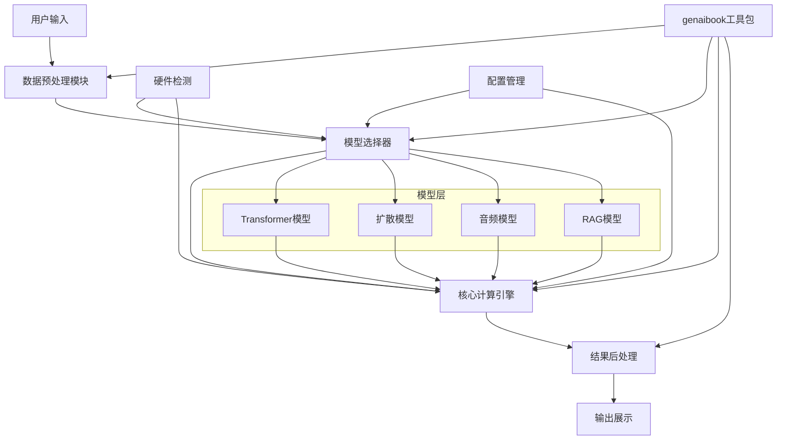
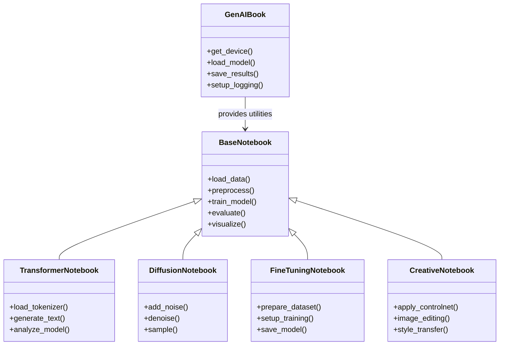
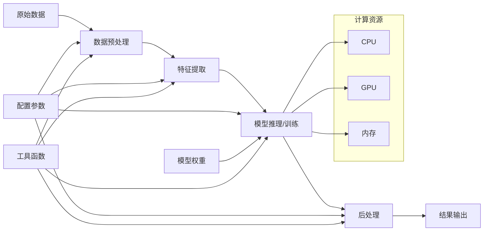
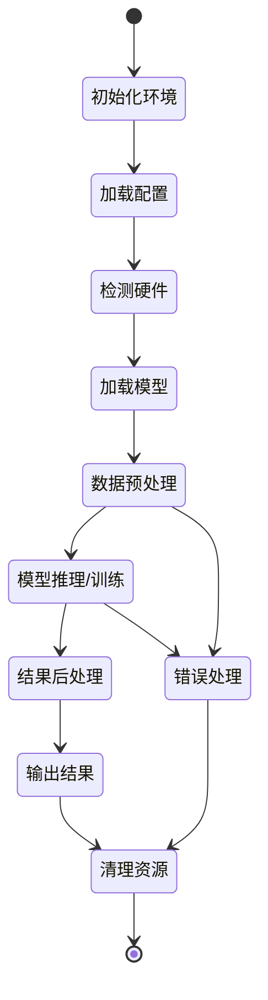
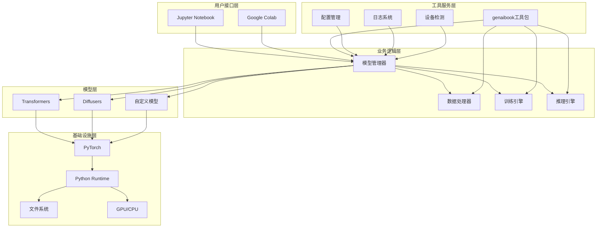

# 架构概览与核心设计

## 技术栈与架构概览

### 主要技术栈
- **深度学习框架**: PyTorch (主要), TensorFlow (部分示例)
- **AI/ML库**: 
  - Transformers (Hugging Face) - Transformer模型实现
  - Diffusers - 扩散模型和Stable Diffusion
  - Datasets - 数据集处理和管理
  - Accelerate - 分布式训练和模型加速
- **数据处理**: NumPy, Pandas, Matplotlib
- **音频处理**: (隐含在音频生成章节)
- **文本处理**: LangChain (RAG章节)
- **开发环境**: Jupyter Notebook, Google Colab
- **自定义工具**: genaibook (项目专用工具包)

### 项目整体架构
这是一个**教育导向的模块化学习架构**，具有以下特点：

1. **分层教学架构**: 按学习难度和主题分为多个独立模块
2. **实验驱动架构**: 每个模块都是可独立运行的Jupyter Notebook
3. **渐进式架构**: 从基础概念到高级应用的递进式设计
4. **云原生架构**: 支持本地和云端(Colab)两种运行环境

## 核心架构设计原则与设计模式

### 核心架构设计原则
1. **教学优先原则**: 架构设计以教学效果为核心目标
2. **模块化原则**: 每个notebook独立完整，降低学习门槛
3. **渐进式原则**: 知识点按难度递进，符合认知规律
4. **实践导向原则**: 理论与实践紧密结合
5. **可复现性原则**: 所有代码示例都应能稳定运行
6. **资源优化原则**: 考虑计算资源限制，提供多种运行方案

### 采用的设计模式
1. **模板方法模式**: 每个notebook遵循相似的结构模式
   - 理论介绍 → 代码实现 → 实验验证 → 练习题目
2. **工厂模式**: genaibook包提供统一的工具函数创建
3. **策略模式**: 不同模型和算法采用统一的接口设计
4. **适配器模式**: 为不同硬件环境提供适配方案
5. **观察者模式**: 训练过程中的进度监控和日志记录

## 模块划分与主要组件交互

### 模块划分依据
1. **按技术主题划分**:
   - 基础理论模块 (01-03)
   - 核心技术模块 (04-05) 
   - 高级应用模块 (06-09)
   - 综合实践模块 (13)

2. **按学习难度划分**:
   - 入门级: 01_introduction, 02_transformers
   - 中级: 03_compressing, 04_diffusion, 05_stable_diffusion
   - 高级: 06-09 (微调和应用)
   - 专家级: 13_rag

### 各子模块详细分析

#### 01_introduction.ipynb (生成式媒体介绍)
- **输入**: 无特定输入，概念性介绍
- **输出**: 生成式AI基础概念理解
- **核心功能**: 
  - 生成式AI历史和发展
  - 主要应用领域概览
  - 基础术语和概念定义
- **API**: 主要为演示代码，无核心API

#### 02_transformers.ipynb (Transformer模型)
- **输入**: 文本数据、预训练模型
- **输出**: 文本生成结果、模型分析
- **核心功能**:
  - Transformer架构原理
  - 文本预处理和tokenization
  - 预训练模型使用
  - 文本生成任务
- **核心API**: 
  - `transformers.AutoTokenizer`
  - `transformers.AutoModelForCausalLM`
  - `transformers.pipeline`

#### 03_compressing.ipynb (信息压缩与表示)
- **输入**: 高维数据、原始文本/图像
- **输出**: 压缩表示、重构数据
- **核心功能**:
  - 自编码器原理
  - 信息压缩技术
  - 潜在空间表示
  - 数据重构
- **核心API**: 
  - PyTorch自编码器实现
  - 压缩算法接口

#### 04_diffusion.ipynb (扩散模型基础)
- **输入**: 随机噪声、时间步
- **输出**: 生成图像/数据
- **核心功能**:
  - 扩散过程原理
  - 前向和反向过程
  - 噪声调度
  - 简单扩散模型实现
- **核心API**:
  - 自定义扩散模型类
  - 噪声调度器
  - 训练循环

#### 05_stable_diffusion.ipynb (Stable Diffusion)
- **输入**: 文本提示词、随机种子
- **输出**: 高质量图像
- **核心功能**:
  - Stable Diffusion架构
  - 文本到图像生成
  - 条件生成技术
  - 推理优化
- **核心API**:
  - `diffusers.StableDiffusionPipeline`
  - `genaibook.core.get_device()`
  - 提示词工程工具

#### 06_fine_tuning_language_models.ipynb (语言模型微调)
- **输入**: 预训练语言模型、训练数据
- **输出**: 微调后的模型、性能评估
- **核心功能**:
  - 微调原理和方法
  - 数据集准备
  - 训练循环实现
  - 模型评估
- **核心API**:
  - `transformers.Trainer`
  - `datasets.Dataset`
  - 自定义训练循环

#### 07_fine_tuning_diffusion.ipynb (扩散模型微调)
- **输入**: 预训练扩散模型、特定风格数据
- **输出**: 定制化的扩散模型
- **核心功能**:
  - DreamBooth技术
  - 风格微调
  - 概念注入
  - 个性化生成
- **核心API**:
  - `diffusers.DiffusionPipeline`
  - 自定义微调脚本

#### 08_creative_applications_of_t2i.ipynb (创意应用)
- **输入**: 基础Stable Diffusion模型
- **输出**: 创意生成结果
- **核心功能**:
  - ControlNet
  - InstructPix2Pix
  - 图像编辑技术
  - 创意生成工作流
- **核心API**:
  - `diffusers.StableDiffusionControlNetPipeline`
  - 图像处理工具

#### 09_generating_audio.ipynb (音频生成)
- **输入**: 文本描述、音频样本
- **输出**: 生成的音频文件
- **核心功能**:
  - 音频生成模型
  - 文本到语音
  - 音频风格转换
  - 音频编辑
- **核心API**:
  - 音频生成pipeline
  - 音频处理工具

#### 13_rag.ipynb (检索增强生成)
- **输入**: 文档库、用户查询
- **输出**: 基于检索的生成回答
- **核心功能**:
  - 文档检索
  - 向量数据库
  - 检索增强生成
  - 问答系统
- **核心API**:
  - `langchain`相关组件
  - 向量存储接口
  - RAG pipeline

### 主要组件交互方式

## 架构图示

### 类架构图

### 数据流图

### 生命周期图

### 框架图

---

*本阶段分析了项目的技术架构、设计原则、模块划分和组件交互，为后续深入分析奠定基础。*