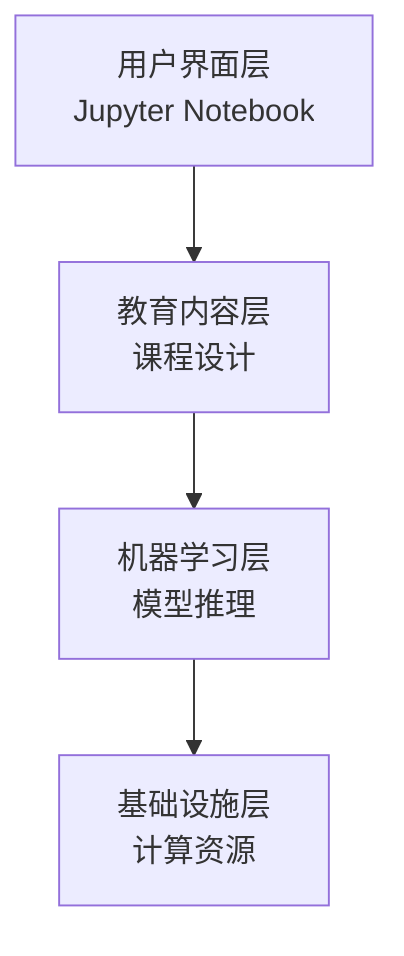

# 文档建议

## Wiki 文档与详细设计文档

### Wiki 文档结构建议

#### 1. 项目概览 Wiki
**文档路径**: `/wiki/项目概览.md`
**目标读者**: 新用户、项目评估者
**核心内容**:
```markdown
# 生成式AI学习项目概览

## 🎯 项目定位
面向AI学习者的系统性生成式AI教育平台，涵盖Transformer、扩散模型、多模态生成等前沿技术。

## 🚀 快速开始
- 一键Colab运行: [Open in Colab](https://colab.research.google.com/github/genaibook/genaibook)
- 本地安装: `pip install genaibook`
- 第一条命令: `import genaibook; genaibook.get_device()`

## 📚 学习路径
1. **零基础入门** → 01-03章 (2-3小时)
2. **模型深入** → 04-05章 (3-4小时)
3. **实战应用** → 06-09章 (4-6小时)
4. **综合项目** → 13章+ (2-3小时)

## 🛠️ 技术栈
- 深度学习: PyTorch, Transformers, Diffusers
- 开发环境: Jupyter, Google Colab
- 硬件要求: GPU推荐 (T4起)

## 📊 项目统计
- ⭐ GitHub Stars: [实时获取]
- 📖 章节数量: 9个核心章节
- 🔧 代码示例: 200+ 可运行示例
- 🎨 覆盖模态: 文本、图像、音频
```

#### 2. 环境配置 Wiki
**文档路径**: `/wiki/环境配置指南.md`
**目标读者**: 开发者、系统管理员
**核心内容**:
```markdown
# 环境配置指南

## 💻 系统要求

### 最低配置
- **CPU**: 4核心 2.0GHz+
- **内存**: 8GB RAM
- **存储**: 20GB 可用空间
- **网络**: 稳定互联网连接

### 推荐配置
- **GPU**: NVIDIA T4/V100/A100
- **内存**: 16GB+ RAM
- **存储**: 50GB+ SSD空间
- **网络**: 高速宽带 (100Mbps+)

## 🐍 Python环境

### 版本要求
```bash
Python 3.8+ (推荐 3.9-3.11)
```

### 虚拟环境创建
```bash
# 使用venv
python -m venv genaibook_env
source genaibook_env/bin/activate  # Linux/Mac
# genaibook_env\Scripts\activate  # Windows

# 使用conda
conda create -n genaibook python=3.9
conda activate genaibook
```

## 📦 依赖安装

### 核心安装
```bash
pip install genaibook  # 一键安装所有依赖
```

### 分步安装 (高级用户)
```bash
# 基础依赖
pip install torch torchvision torchaudio --index-url https://download.pytorch.org/whl/cu118

# Hugging Face生态
pip install transformers diffusers datasets accelerate

# 项目专用包
pip install genaibook

# 可选依赖 (特定章节)
pip install langchain_community pypdf  # RAG章节
pip install gradio  # 交互式演示
pip install xformers  # 内存优化
```

## 🔧 GPU配置

### CUDA检查
```python
import torch
print(f"CUDA可用: {torch.cuda.is_available()}")
print(f"CUDA版本: {torch.version.cuda}")
print(f"GPU数量: {torch.cuda.device_count()}")
for i in range(torch.cuda.device_count()):
    print(f"GPU {i}: {torch.cuda.get_device_name(i)}")
```

### 内存优化设置
```python
# 清理GPU缓存
import torch
torch.cuda.empty_cache()

# 设置内存分片
os.environ["PYTORCH_CUDA_ALLOC_CONF"] = "max_split_size_mb:128"
```

## ☁️ 云端环境

### Google Colab优化
```python
# 检查GPU类型
!nvidia-smi

# 挂载Google Drive
from google.colab import drive
drive.mount('/content/drive')

# 设置缓存路径
import os
os.environ['HF_HOME'] = '/content/drive/MyDrive/hf_cache'
```

### Kaggle Notebooks
```python
# 启用GPU
# Settings → Accelerator → GPU

# 检查可用性
import torch
print(f"GPU可用: {torch.cuda.is_available()}")
print(f"GPU名称: {torch.cuda.get_device_name(0)}")
```
```

#### 3. 故障排除 Wiki
**文档路径**: `/wiki/常见问题与解决方案.md`
**目标读者**: 所有用户
**核心内容**:
```markdown
# 常见问题与解决方案

## 🚨 安装问题

### Q1: pip install genaibook 失败
**症状**: 安装过程中出现依赖冲突或编译错误
**解决方案**:
```bash
# 1. 升级pip
pip install --upgrade pip

# 2. 使用清华源
pip install genaibook -i https://pypi.tuna.tsinghua.edu.cn/simple

# 3. 分步安装依赖
pip install torch transformers diffusers
pip install genaibook --no-deps
```

### Q2: CUDA版本不匹配
**症状**: RuntimeError: CUDA error: no kernel image is available
**解决方案**:
```bash
# 检查CUDA版本
nvcc --version
nvidia-smi

# 安装对应PyTorch版本
# CUDA 11.8
pip install torch torchvision torchaudio --index-url https://download.pytorch.org/whl/cu118
# CUDA 12.1
pip install torch torchvision torchaudio --index-url https://download.pytorch.org/whl/cu121
```

## 🔄 运行时错误

### Q3: Out of Memory (OOM)
**症状**: RuntimeError: CUDA out of memory
**解决方案**:
```python
# 1. 减少batch size
pipe = pipe.to("cuda")
pipe.enable_attention_slicing()  # 启用注意力切片
pipe.enable_vae_slicing()       # 启用VAE切片

# 2. 使用半精度
pipe = pipe.to(torch.float16)

# 3. 清理缓存
import torch
torch.cuda.empty_cache()
```

### Q4: 模型下载超时
**症状**: HTTPSConnectionPool timeout
**解决方案**:
```python
# 1. 设置超时时间
import os
os.environ['HF_HUB_DOWNLOAD_TIMEOUT'] = '1200'

# 2. 使用镜像源
os.environ['HF_ENDPOINT'] = 'https://hf-mirror.com'

# 3. 手动下载
# 访问 https://huggingface.co/模型名称
# 下载文件到本地，然后加载
model = AutoModel.from_pretrained("./本地路径")
```

## 🐌 性能问题

### Q5: 推理速度过慢
**症状**: 单张图像生成超过2分钟
**排查步骤**:
1. 检查GPU是否启用: `torch.cuda.is_available()`
2. 检查推理步数: 建议20-30步
3. 启用优化选项:
```python
pipe.enable_xformers_memory_efficient_attention()
pipe.enable_model_cpu_offload()
```

### Q6: 内存使用过高
**症状**: 系统内存占用超过80%
**优化方案**:
```python
# 1. 启用CPU卸载
pipe.enable_model_cpu_offload()

# 2. 使用8bit量化
from transformers import BitsAndBytesConfig
bnb_config = BitsAndBytesConfig(load_in_8bit=True)

# 3. 分批处理
for i in range(0, len(prompts), batch_size):
    batch_prompts = prompts[i:i+batch_size]
    results = pipe(batch_prompts)
    # 处理结果后立即清理
    del results
```

## 📊 结果质量问题

### Q7: 生成图像质量差
**症状**: 模糊、失真、不符合预期
**解决方案**:
```python
# 1. 调整引导系数
image = pipe(prompt, guidance_scale=7.5).images[0]  # 推荐7-12

# 2. 增加推理步数
image = pipe(prompt, num_inference_steps=50).images[0]  # 推荐20-50

# 3. 优化提示词
prompt = "high quality, detailed, 4K, professional photography of..."
```

### Q8: 音频生成噪音
**症状**: 生成音频包含噪音或失真
**解决方案**:
```python
# 1. 调整生成参数
audio = model.generate(
    input_ids=input_ids,
    max_new_tokens=1000,
    do_sample=True,
    temperature=0.7,
    top_p=0.9
)

# 2. 后处理滤波
import librosa
audio_clean = librosa.effects.remix(audio, intervals=librosa.effects.split(audio))
```
```

### 详细设计文档建议

#### 1. 系统架构设计文档
**文档路径**: `/docs/系统架构设计.md`
**目标读者**: 架构师、核心开发者
**关键章节**:

```markdown
# 系统架构设计文档

## 1. 总体架构

### 1.1 架构原则
- **教育优先**: 以教学效果为核心设计目标
- **模块化设计**: 低耦合、高内聚的组件设计
- **云端原生**: 优先支持云端运行环境
- **渐进增强**: 从基础功能到高级特性的渐进式支持

### 1.2 技术架构图


### 1.3 核心组件
- **内容管理组件**: Notebook解析、执行、展示
- **模型服务组件**: 模型加载、推理、缓存
- **资源管理组件**: 设备检测、内存管理、性能监控
- **用户交互组件**: 可视化、音频播放、进度反馈

## 2. 数据流设计

### 2.1 请求处理流程
1. 用户通过Jupyter界面发起请求
2. 内容管理组件解析请求类型
3. 模型服务组件加载所需模型
4. 执行推理并返回结果
5. 用户交互组件展示结果

### 2.2 数据持久化
- **模型缓存**: Hugging Face Hub本地缓存
- **用户数据**: Google Drive/本地文件系统
- **临时文件**: 系统临时目录，定期清理

## 3. 性能设计

### 3.1 性能指标
- **响应时间**: 单次推理 < 60秒
- **并发能力**: 支持1用户并发 (Notebook特性)
- **资源使用**: GPU内存 < 16GB, 系统内存 < 32GB
- **可用性**: 服务可用时间 > 99%

### 3.2 优化策略
- **模型优化**: 量化、剪枝、知识蒸馏
- **推理优化**: 批处理、缓存、预编译
- **内存优化**: 梯度检查点、CPU卸载、显存管理
- **网络优化**: 模型预下载、增量更新、压缩传输
```

#### 2. 模块详细设计文档
**文档路径**: `/docs/模块详细设计.md`
**目标读者**: 开发者、维护者
**关键章节**:

```markdown
# 模块详细设计文档

## 1. genaibook.core 模块

### 1.1 模块职责
提供项目核心工具函数和设备管理功能

### 1.2 类设计

#### DeviceManager 类
```python
class DeviceManager:
    """设备管理器"""
    
    def get_optimal_device(self) -> torch.device:
        """获取最优计算设备"""
        pass
    
    def get_memory_info(self) -> Dict[str, int]:
        """获取设备内存信息"""
        pass
    
    def cleanup_memory(self) -> None:
        """清理设备内存"""
        pass
```

#### ImageUtils 类
```python
class ImageUtils:
    """图像处理工具类"""
    
    def create_image_grid(self, images: List[Image.Image], 
                         rows: int, cols: int) -> Image.Image:
        """创建图像网格"""
        pass
    
    def load_image_from_url(self, url: str) -> Image.Image:
        """从URL加载图像"""
        pass
```

### 1.3 接口定义
- **get_device()**: -> torch.device
- **image_grid()**: -> PIL.Image.Image
- **show_images()**: -> None
- **load_image()**: -> PIL.Image.Image

## 2. 模型适配层设计

### 2.1 模型包装器
为不同模型提供统一接口

```python
class ModelWrapper(ABC):
    """模型包装器基类"""
    
    @abstractmethod
    def load_model(self, model_name: str) -> Any:
        pass
    
    @abstractmethod
    def generate(self, inputs: Dict[str, Any]) -> Any:
        pass
    
    @abstractmethod
    def get_model_info(self) -> Dict[str, Any]:
        pass
```

### 2.2 具体实现
- **TransformerWrapper**: 文本生成模型
- **DiffusionWrapper**: 图像生成模型
- **AudioWrapper**: 音频生成模型

## 3. 性能监控模块

### 3.1 监控指标
- **时间指标**: 加载时间、推理时间、总响应时间
- **资源指标**: CPU使用率、GPU使用率、内存使用量
- **质量指标**: 生成质量评分、用户满意度

### 3.2 数据收集
```python
class PerformanceMonitor:
    """性能监控器"""
    
    def start_monitoring(self, operation: str) -> str:
        """开始监控操作"""
        pass
    
    def end_monitoring(self, monitor_id: str) -> PerformanceMetrics:
        """结束监控并返回指标"""
        pass
```
```

#### 3. API设计文档
**文档路径**: `/docs/API设计文档.md`
**目标读者**: API开发者、集成商
**关键章节**:

```markdown
# API设计文档

## 1. 设计原则

### 1.1 RESTful原则
- **资源导向**: 以资源为中心设计API
- **统一接口**: 使用标准HTTP方法
- **无状态**: 每个请求包含完整信息
- **可缓存**: 支持响应缓存

### 1.2 教育场景适配
- **简化接口**: 隐藏复杂技术细节
- **错误友好**: 提供详细的错误信息和建议
- **版本兼容**: 支持API版本演进

## 2. 端点设计

### 2.1 模型管理API
```http
GET /api/v1/models
获取可用模型列表

Response:
{
  "models": [
    {
      "id": "stable-diffusion-v1-5",
      "name": "Stable Diffusion v1.5",
      "type": "image_generation",
      "description": "文本到图像生成模型",
      "requirements": {
        "min_gpu_memory": "8GB",
        "recommended_steps": 20
      }
    }
  ]
}
```

### 2.2 生成API
```http
POST /api/v1/generate
创建生成任务

Request:
{
  "model_id": "stable-diffusion-v1-5",
  "inputs": {
    "prompt": "a beautiful sunset",
    "negative_prompt": "blurry, low quality",
    "num_inference_steps": 20,
    "guidance_scale": 7.5
  },
  "options": {
    "timeout": 60,
    "callback_url": "https://example.com/callback"
  }
}

Response:
{
  "task_id": "task_123456",
  "status": "processing",
  "estimated_time": 30
}
```

## 3. 错误处理

### 3.1 错误码定义
```python
class ErrorCode:
    SUCCESS = 200
    BAD_REQUEST = 400
    UNAUTHORIZED = 401
    FORBIDDEN = 403
    NOT_FOUND = 404
    RATE_LIMITED = 429
    INTERNAL_ERROR = 500
    SERVICE_UNAVAILABLE = 503
```

### 3.2 错误响应格式
```json
{
  "error": {
    "code": "OUT_OF_MEMORY",
    "message": "GPU内存不足",
    "details": {
      "required_memory": "12GB",
      "available_memory": "8GB",
      "suggestion": "请减少batch size或使用更小的模型"
    },
    "request_id": "req_123456"
  }
}
```
```

---

*本分析文档为Mi Code AI助手生成，提供了生成式AI项目文档体系的全面建议*